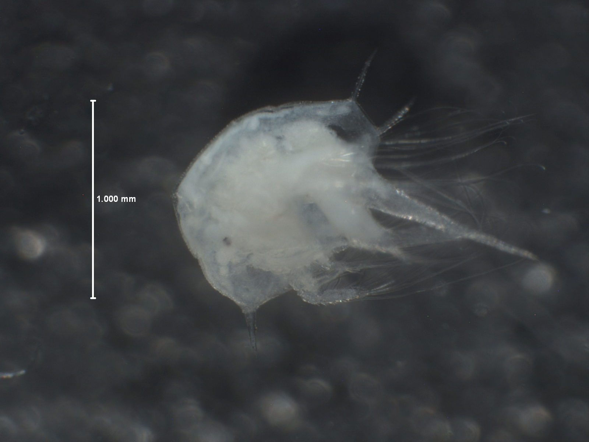
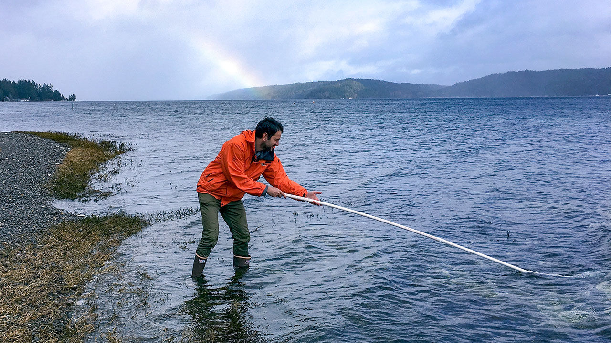

name:bio
class: nord-dark, center
background-size: cover


background-image: linear-gradient(150deg,rgba(46, 52, 64, 10%),rgba(46, 52, 64, 90%),rgba(46, 52, 64, 50%),rgba(46, 52, 64, 10%)), url(images/eDNA_concept.png)

```{r setup, include=FALSE}
options(htmltools.dir.version = FALSE)
knitr::opts_chunk$set(echo = F,
                      warning = FALSE,
                      message = FALSE)
library(tidyverse)
library(leaflet)
library(here)
library (kableExtra)
```

# .huge[*eDNA metabarcoding*]

## *and other sequencing adventures*

```{css, echo=F}
.small { font-size: 70% }
.huge  { font-size: 120% }

.highlight-last-item > ul > li, 
.highlight-last-item > ol > li {
  opacity: 0.5;
}
.highlight-last-item > ul > li:last-of-type,
.highlight-last-item > ol > li:last-of-type {
  opacity: 1;
}

.bold-last-item > ul > li:last-of-type,
.bold-last-item > ol > li:last-of-type {
  font-weight: bold;
}
```


.footnote[.huge[

</br>
</br>
</br>
**Ramón Gallego Simón**
]]

???

Image credit: [ Copyright Kelly Lance 2014]

---

name:bio
class: nord-dark
layout: true


##  .center[Bio]

---
class: middle, nord-dark
background-image: linear-gradient(150deg,rgba(46, 52, 64, 60%),rgba(46, 52, 64, 60%),rgba(46, 52, 64, 60%),rgba(46, 52, 64, 20%)),  url("images/Teide.jpg") 
background-position: center
background-size: cover

.leftmost-column[
.fancy[Ramón Gallego Simón]


```{r, echo =F}

```

From the Canary Islands, Spain
]


.center-column[
```{r, echo = F}
leaflet() %>%
  addTiles() %>%
  setView(lat = 28.3, lng = -16.5, zoom = 5.5)

```
]

.rightmost-column[
.middle[
```{r, echo = F}
knitr::include_graphics("images/Canary_Islands.jpg")
```
</br>
```{r, echo = F}

```

]

]

---
layout: false
class: middle, nord-dark
background-image: linear-gradient(150deg,rgba(46, 52, 64, 60%),rgba(46, 52, 64, 60%),rgba(46, 52, 64, 60%),rgba(46, 52, 64, 20%)),  url("images/Madridmequema.jpg") 
background-position: center
background-size: cover


## .center[.bold[Ramón Gallego Simón]]

.leftmost-column[

```{r, out.height='25%'}
knitr::include_graphics("images/Cabo_De_Gata.jpg")
```
*BSc and MSc in Madrid, Spain*

```{r, out.height='25%'}
knitr::include_graphics("images/UAM.white.png")
#TODO: Text box
```


]

--

.center-column[
.center[
```{r, out.width='75%'}


```

*PhD in Auckland, Aotearoa New Zealand*

```{r, out.height='25%',out.extra='style="background-color: #9ecff7; padding:5px; display: inline-block;.Nord-dark-damp-img"'}
knitr::include_graphics("images/uoa-logo-2015-reverse.png")
#knitr::include_graphics("images/NIWA_Logo2018.png")
#TODO: Text box
```
]
]
--
.rightmost-column[

```{r}
knitr::include_graphics("images/PNW.jpg")
```
*To a Postdoc in Seattle, WA*

```{r, out.extra='style="background-color: #9ecff7; padding:5px; display: inline-block;"'}
knitr::include_graphics("images/UW_trans.png")
knitr::include_graphics("images/NOAA-fisheries-logo.jpg")
```

]
---
class: inverse, center, middle

# Uso de herramientas geneticas para identificación de especies

---
class:  middle
# Principio básico


.pull-left[
</br>
</br>
</br>
</br>

 * ### Secuencias de ADN de animales de la misma especie deben ser más parecidas entre ellas que a secuencias de otras especies
]

.pull-right[

```{r}
library (ggimage)
tibble(x = rep(c(0.01,0.11),2), y = c(0.1,0.4,0.6,0.9), image = "images/dna-svgrepo-com.svg") %>% 
ggplot(aes(x = x,y = y, image = image)) + 
  geom_image()+
  annotate(geom = "text", x = 0.2, y = 0.7, label = "AGTCCT...CTTT  ->", color = "red") +
  annotate(geom = "text", x = 0.2, y = 0.3, label = "AGTGAT...CAGT  ->") +
  fishualize::add_fishape(family = "Acanthuridae",
               option = "Naso_unicornis",
               xmin = 0.5, xmax = 0.9, ymin = 0.5, ymax =0.9) +
  fishualize::add_fishape(xmin = 0.5,xmax = 0.9, ymin = 0.1, ymax =0.5,
                        family = "Scorpaenidae",
                        option = "Sebastes_caurinus") +
  lims(x = c(0,1), y = c(0,1)) + theme_void()
```
 
]


---

background-image: url(images/Similarity.png) 
background-position: center
background-size: contain

## Principio básico

---


## Principio básico

Con una base de datos completa, podemos identificar secuencias de ADN origen desconocido


```{r,  out.width='75%'}

```

---


## Principio básico

Usando distintos métodos estadísticos, asignamos una identidad a las secuencias


```{r,  out.width='75%'}

```

---
class: inverse, center, middle
# Identificar larvas de invertebrados antarticos

---
class: nord-dark
layout: true
name: Meroplankton
background-image: linear-gradient(150deg,rgba(46, 52, 64, 60%),rgba(46, 52, 64, 60%),rgba(46, 52, 64, 60%),rgba(46, 52, 64, 20%)),url("images/fondo.antartida.JPG")
background-position: center
background-size: cover

---

## What is the larval diversity in the Coastal Ross Sea?

</br>
.pull-left[

]

.pull-right[

.pull-left[]

.pull-right[]

</br>

.center[]

]
---
class: middle

.left-column[
* ### Many types - how many species?
</br>

</br>

]


.right-column[


]

.footnote.oc-bg-black.opacity-10.nord-dark[
**Gallego, R.**, Heimeier, D., Lavery, S., Sewell, M.A. 2015. The meroplankton communities from the
coastal Ross Sea: a latitudinal study. Hydrobiologia, 761 (1): 195-209]

???

And I was interested in testing the idea of a decreasing planktonic diversity at higher latitudes, known as Thorson's rule

But a crucial step is a reliable identification of the species found **transition**

---
class: nord-dark
name: Next steps Bathylasma

## .center[ Two life stages: how does environmental change affects them?]

.left-column[

  * Larvae 



  * Adults


]

.right-column[
.center[]
<!--  -->
]


???

One of the most crucial points in my research path came with the idea that a meroplankton community not 
only tells us about the diversity similarity along a gradient, but also about the life history of the species present 
---
name: Bathylasma larvae and adult
class: nord-dark
### Habitat Suitability changes differently for 
.pull-left[
### Adults

]

.pull-right[
### Larvae

]

---
name: Bathylasma larvae and adult
class: nord-dark
### Habitat Suitability changes differently for 
.pull-left[
### Adults

]

.pull-right[
### Larvae

]

--

.footnote.oc-bg-black.opacity-10.nord-dark[
**Gallego, R.**, Basher, Z., Lavery, S., Dennis, T.E., Sewell, M.A. 2017. On the need to consider multiphasic sensitivity of marine organisms to climate change: a case study of the Antarctic acorn barnacle.
Journal of Biogeography, 44: 2165-2175]

???

And we opened the door to applying distribution models to species detected using molecular tools,
and forecasting shifts in their distributions with climate change. To which we'll come back later  
---

class: inverse, center, middle
# ADN ambiental 

---
name: concept
class: nord-dark, center
background-size: cover

layout: false
background-image: url(images/eDNA_concept.png)

---
name: concept
class: nord-dark, center
background-size: cover

layout: true
background-image: linear-gradient(150deg,rgba(46, 52, 64, 10%),rgba(46, 52, 64, 90%),rgba(46, 52, 64, 50%),rgba(46, 52, 64, 10%)),url(images/eDNA_concept.png)


---
class: middle

# .bold[Todos los seres vivos dejan restos de ADN en el medio ambiente]

--
</br>
</br>

# .bold[El desafío está en rescatar y obtener la información]

---
class: middle

* ## *La tecnologia SBS permite secuenciar millones de fragmentos cortos (~500 bp max)*
</br>
* ## *El objetivo es obtener una mirada transversal al ecositema, obteniendo copias de fragmentos cortos con mucha información*


---
layout: false
name: concept
class: nord-light, center

# *Diseño de primers *

###.bold[Dos secciones del genoma compartida  ]


---
class: nord-light, center

# *Diseño de primers *

###.bold[Dos secciones del genoma compartida  ]


---
class: nord-light, center

# *Diseño de primers *

###.bold[Dos secciones del genoma compartida  ]
###.bold[Incluyendo una zona altamente diferenciada  ]


---
class: nord-light, center

# *Diseño de primers *


### Dos grandes grupos de zonas candidatas

.pull-left[
.bold[ribosomal RNA]
 
 1. Los puentes estan conservados
 2. Los loops mutan libremente
 3. Ejemplos 16SrRNA, 18SrRNA 
 


]
.pull-right[
.bold[Genes de proteinas transmembrana]

   1. El AA tiene que ser hidrofobo
   2. La tercera base puede cambiar
   2. Mejor si son mitocondriales  (Hay muchas)
   3. Ejemplos: COI, Cytb


]


---
class: nord-light

# Diseño de primers 

# *Secuenciacion Masiva*

</br>

.left-column[
1. .huge[*Sequencing by Synthesis*]

]
 
.right-column[
```{r, out.width='75%' }
knitr::include_graphics("images/SeqbySyn2.png")
```
] 

---

class: nord-light

# Diseño de primers 

# *Secuenciación Masiva*

</br>

.left-column[
  1. .huge[Sequencing by Synthesis]


  1. .huge[*Millones de secuencias*]

1. .huge[*Cientos de muestras*]

]
 
.right-column[
```{r, out.width='75%' }
knitr::include_graphics("images/Seqbysyn2.png")
```
] 


---

name: concept
class: nord-dark, center
background-size: cover

layout: true
background-image: linear-gradient(150deg,rgba(46, 52, 64, 10%),rgba(46, 52, 64, 90%),rgba(46, 52, 64, 50%),rgba(46, 52, 64, 10%)),url(images/eDNA_concept.png)

---

class: middle 

## ADN de todos los organismos

</br>

## Fragmento de ADN que los identifica

</br>

## Mucha información de muchas muestras
 </br>
 
## *Muestreo sencillo y economico*


---

class: middle




---
name: concept
class: nord-dark, center, middle
background-size: cover

# *Podemos investigar preguntas ecologicas *

# *sin un compromiso de profundidad y precisión*


---
name:OA_cover
layout: true
class: nord-dark,  typo-selection
background-image: linear-gradient(150deg, rgba(0, 0, 0, 100%), rgba(0, 0, 0, 50%), rgba(0, 0, 0, 20%)),url(images/OA_fondo.jpg)
background-size: cover
### .center[Ocean Acidification and warming]

---


class: nord-dark
name: How will forecasted conditions shape coastal communities


.pull-left[
</br>
.center[]]

.pull-right[
</br>
 
]

---
class: nord-dark
## .center[.fancy[Afecta a muchas especies ]
</br>

.pull-left[

]


.pull-right[
]
]


???
With global warming and increased pCO2 levels, there is little doubt that future marine communities will have to face a warmer, more acidic ocean
---
class: nord-dark
name: A lot of info on many spp

 

--


--


--


???

Those effects are not happenning in a vacuum, but likely with Temp
And in different directions
---
class: nord-dark
Name: Ecosystem-wide: not so much


.pull-left[

]

--

.pull-right[
.middle[
.fancy[
## *Expanding to other ecosystems*
]]
]
---
name: WHy Hood Canal
class: middle, nord-dark
###.center[.fancy[.title[Why the Puget Sound?]]]

Naturally occuring High *p*CO<sub>2</sub>  levels offer a view of not far-fetched conditions


---
class: nord-dark
name: Research plan

##.center[.fancy[.title[Diseño experimental]]]

.pull-left[

```{r, echo = F, out.width= '90%'}

leaflet(data = read_csv(here("data","site.info.csv"))) %>% 
  addTiles() %>% 
  setView(lat = 47.5, lng = -122.5, zoom = 7) %>% 
  addMarkers(label = ~Site, 
             labelOptions = labelOptions(interactive = FALSE, clickable = NULL, noHide = NULL,
  permanent = FALSE, className = "", direction = "auto",
  offset = c(1, 1), opacity = 1, textsize = "20px",
  textOnly = FALSE, style = NULL, 
  sticky = TRUE)
  )
```
]

--

.pull-right[

.center[

]

]

---
name: Smpling design
class: nord-dark
##.center[.fancy[Diseño experimental]]

.left-column[

</br>

* .huge.bold[Muestreo mensual]
      * eDNA y variables ambientales

*  .huge.bold[Replicas biologicas]

* .huge.bold[Replicas tecnicas]
]
.right-column.center[
</br>
 ]

???

This sampling was carried out in a single day, which when working in a coastal sampling, brings in a major 

---
name: Shiny app
class: nord-dark

### .center[.nord12[Pregunta 1]: ¿Podemos detectar las fluctuaciones en presencia y abundancia de las especies de interés? ]

</br>


<video width="320" height="240" controls>
<source src="images/Shiny.mov" type="video/mp4">
</video>


---
class: nord-dark
name: using both PA and eDNAindex
layout: true
background-image: linear-gradient(150deg, rgba(0, 0, 0, 100%), rgba(0, 0, 0, 50%), rgba(0, 0, 0, 20%)),url(images/OA_fondo.jpg)
background-size: cover
---

### .center[.nord12[Pregunta 2]: ¿Hay distintas comunidades asociadas con <br> Temperatura y pH?]

---
### .nord12[Pregunta 2]: Community changes
.center[

]
---
### .nord12[Pregunta 2]: Community changes
.center[

]
---
### .nord12[Pregunta 2]: Community changes
.center[

]
---
layout: true
template: Dowehavewhatweneed
name: Q3
class: nord-dark

---
### .nord12[Pregunta 3]: ¿Qué pinta tiene el futuro Puget Sound para las especies de interés?

</br>
##.fancy[Modelos de presencia de cada taxon:]
</br>
* .huge.bold[Usamos una regresión logística (presencia/ausencia)]
</br>

* .huge.bold[Ajustado independiente en cada .nord13[área y estación]]
</br>
* .huge.bold[y con temperatura y pH como variables explicativas]
</br>
---

name: Projections to 2095
### .nord12.bold[Q3] - Estimando las condiciones en el Puget Sound (RCP8.5)


.left-column[

*  .huge[Usando la estimación de Khangaonkar et al, 2019]

*  .huge[La predicción muestra algunos valores .nord13[ extremos] ]

* .huge[La mayoría de los valores .nord13[se ven en el escenario actual]]

]

.right-column[
]

???

Taking advantage from recently published models for the inner sea
---


## Cada especie responde de un modo distinto


---


## Cambios de diversidad en varios grupos


---

layout: false
class: middle, nord-dark
background-image: linear-gradient(150deg, rgba(0, 0, 0, 100%), rgba(0, 0, 0, 50%), rgba(0, 0, 0, 20%)),url(images/OA_fondo.jpg)
background-size: cover

## .center.bold[Muchas Gracias]
</br>
.content-box-gray[.nord1[
- ### **Mentores** y supervisores: Krista Nichols, Ana Laca, Linda Park, Ole Shelton, Ryan Kelly, Mary Sewell, Rochelle Constantine, Eduardo López

- ###  **Compañeros de laboratorio, estudiantes y amigos**
- ###  **Financiación**: NOAA, UW, Packard Foundation, University of Auckland, MPI, Ana Laca

]]


---

layout:false
class: nord-light,  middle, typo-selection
background-image: linear-gradient(150deg, rgba(0, 0, 0, 100%), rgba(0, 0, 0, 50%), rgba(0, 0, 0, 20%)),url(images/OA_fondo.jpg)
background-size: cover
### .huge[.nord5[.center[ .bold[Building mitochondrial references ]]]]
### .nord5[.center[ .bold[for species identification ]]]

---

layout: true
class: nord-light,  typo-selection
background-image: linear-gradient(150deg, rgba(0, 0, 0, 100%), rgba(0, 0, 0, 50%), rgba(0, 0, 0, 20%)),url(images/OA_fondo.jpg)
background-size: cover

---
### .huge[.nord5[.center[ .bold[Building mitochondrial reference databases ]]]]
.huge[.nord5[.center[.huge[*A team effort*]]]]

.pull-left[
.content-box-yellow[

- Led by *Ana Ramón-Laca*

- Made possible by support from PIs *Krista Nichols* at NOAA and *Ryan Kelly* at UW

- No point on having a guest room

]


]

.pull-right[


]


---
name: reasons


### .huge[.nord5[.center[ .bold[*Motivation*]]]]

.pull-left[

</br>
</br>

.content-box-yellow[


- Obtaining full mitogenomes affordabl-ish

- PCR-free method

- Without requiring to pool 100s of specimens

- Obtaining whole-length fragments

]
]

---
name: Approaches


### .huge[.nord5[.center[ .bold[*Mitochondrial enrichment*]]]]

.pull-left[
.content-box-blue[


- Mitochondrial enrichment at different levels:
   - Tissue with higher mitochondrial content
]


]

.pull-right[

.content-box-blue[


]
]

---

.huge[.nord5[.center[.huge[*Mitochondrial enrichment*]]]]

.pull-left[
.content-box-blue[


- Mitochondrial enrichment at different levels:
   - Tissue with higher mitochondrial content
   - DNA Isolation techniques
   
]


]

.pull-right[

.content-box-blue[


]
]

---

.huge[.nord5[.center[.huge[*Mitochondrial enrichment*]]]]

.pull-left[
.content-box-blue[


- Mitochondrial enrichment at different levels:
   - Tissue with higher mitochondrial content
   - DNA Isolation techniques
   - Enrichment:
      - Exonuclease targetting linear DNA
      - De-phosphorilation and cutting with CRISPR-CAS9
   
]


]

.pull-right[

.content-box-blue[


]
]

---
.huge[.nord5[.center[.huge[*Mitochondrial enrichment*]]]]

.pull-left[
.content-box-blue[


- Mitochondrial enrichment at different levels:
   - Tissue with higher mitochondrial content
   - DNA Isolation techniques
- Enrichment:
      - Exonuclease targetting linear DNA
      - De-phosphorilation and cutting with CRISPR-CAS9
- Sequencing enrichment:
  - Adaptive sampling with reference mitogenomes
   
]


]


.pull-right[

.content-box-blue[


]
]
---
layout: true
class: nord-light,  typo-selection
background-image: linear-gradient(150deg, rgba(0, 0, 0, 100%), rgba(0, 0, 0, 50%), rgba(0, 0, 0, 20%)),url(images/OA_fondo.jpg)
background-size: cover
## .nord5[.center[*General Workflow*]]

---


.left-column[
</br>
.content-box-blue[

  - Library prep with Ligation or Rapid Kit
 
  - Run on a FlowCell 9.4
 
  - Run for ~ 8 hrs
  - Basecalling using SUP
  - Map to reference with minimap2

]]

.right-column[

]


---
layout: true
class: nord-light,  typo-selection
background-image: linear-gradient(150deg, rgba(0, 0, 0, 100%), rgba(0, 0, 0, 50%), rgba(0, 0, 0, 20%)),url(images/OA_fondo.jpg)
background-size: cover

---

name: results1

## .nord5[.center[*Great Coverage all across mitogenome*]]


.content-box-yellow[

- With *CRISPR-CAS9*, coverage varies around cutting regions
]


--
.content-box-yellow[

- With *Exonuclease*, Coverage is really uniform
]


---

.content-box-yellow[
- .huge[.nord1[*All methods heavily dependent on extraction Quality and fragment length*]]]


.content-box-purple[
</br>
.pull-left[
.content-box-yellow[

- With *CRISPR-CAS9*, coverage varies around cutting regions


```{r, results='asis'}
tabl <- "
|     | CAS9      | gDNA depletion|
              |-----|:---------:|:-------------:|
              |  Min| 1,117X    |       647X	  |
              |  Max| 14,299X   |        	875X  |
              |  Ave| 8,971X    |  805X         |
              |  Mean seq-length| 4000bp|5700bp |
              |  Total Reads| 78k | 623k        |
              |  On Target| 36k   | 2309        |"
cat(tabl)
```


]
]


.pull-right[
.content-box-blue[


]]
]]